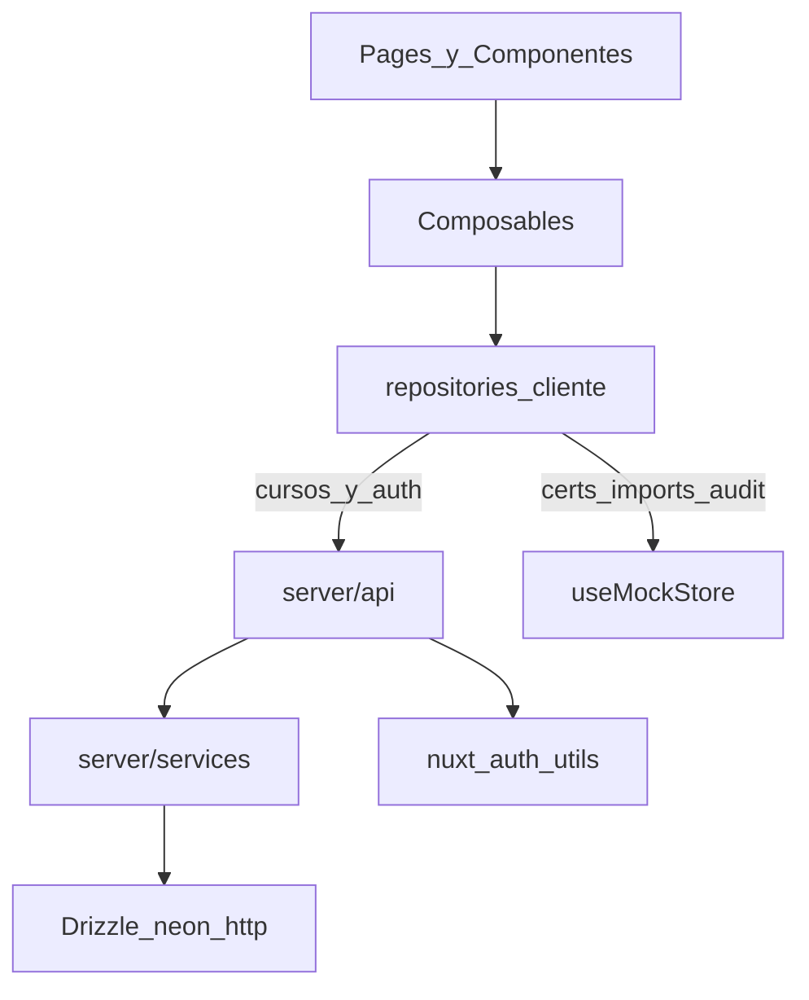

# WayAcademyValidator — Fase 2: fundamentos reales de datos y administración

## 1. Diagnóstico breve del estado actual

El prototipo visual está completo y estable:

- Stack: Nuxt `^4.4.8`, Nuxt UI `^4.9.0`, Tailwind 4, TypeScript `^6.0.3`, ESLint 10, sin capa `server/`.
- Datos: repositorios mock → [`useMockStore`](app/composables/useMockStore.ts) (`useState`) ← seeds en [`app/mock/`](app/mock/).
- Auth demo: [`admin-auth.repository.ts`](app/repositories/admin-auth.repository.ts) con `admin`/`demo1234`; sesión solo en memoria vía [`useAdminSession`](app/composables/useAdminSession.ts).
- Cursos: [`courses.repository.ts`](app/repositories/courses.repository.ts) muta el store; `setPublished` también sincroniza `publicVisible` en certificados mock.
- Sin clasificador reutilizable de conflictos: la criticidad está hardcodeada en seeds/`simulatePreview` (la fase 2 sí debe **extraer** utilidades de clasificación para poder probarlas, sin conectar CSV real).
- CI: [`.github/workflows/ci.yml`](.github/workflows/ci.yml) con Node 22, `npm ci`, lint y typecheck (sin test ni build).
- UI: Nuxt UI + Tailwind; sin Pinia ni frameworks visuales ajenos.

## 2. Confirmación Git y commit base

Comprobado en solo lectura (diagnóstico corregido):

| Comprobación | Resultado |
|--------------|-----------|
| Rama actual | `main` |
| HEAD | `351615547f642d3d6239f29ef1b45f65d5d5a2a6` |
| Mensaje | `feat: create WayAcademyValidator visual prototype` |
| Objeto `3516155` | Existe (`commit`) |
| Working tree | **No completamente limpio** |
| Pendiente esperado | Untracked: [`.cursor/plans/fase_2_datos_auth_6cec4bb6.plan.md`](.cursor/plans/fase_2_datos_auth_6cec4bb6.plan.md) |
| Diff tracked | Vacío (sin modificaciones staged/unstaged en archivos versionados) |

El plan está permitido por `.gitignore` (`!.cursor/plans/*.plan.md`) pero aún no versionado. **No** debe añadirse a `main`.

### Arranque Git de la implementación (obligatorio)

1. Verificar que el único cambio pendiente sea este plan untracked. Si aparece cualquier otro archivo modificado/untracked inesperado: **detenerse** y no crear la rama ni hacer commits.
2. Confirmar `main` en `3516155`.
3. `git checkout -b feat/phase-2-data-auth` (el archivo untracked se conserva al cambiar de rama).
4. Primer commit de la rama (solo el plan):

```text
docs: add phase 2 implementation plan
```

5. Toda la implementación posterior únicamente en `feat/phase-2-data-auth`.
6. No commits en `main`; no merge; no push; no PR sin autorización explícita.

## 3. Decisiones de arquitectura

### Principio de capas



- Páginas/componentes **nunca** importan Drizzle, Neon ni `server/database`.
- Código de navegador **nunca** importa módulos bajo `server/` ni el driver Neon.
- Contratos de composables se conservan donde sea razonable; los repositorios de cursos y auth pasan a llamar `$fetch`/APIs.
- Tipos de dominio (`app/types/`), esquemas Zod (`server/schemas/` + compartidos) y tablas Drizzle activas se mantienen separados; los mappers no filtran `passwordHash` ni secretos.

### Autenticación (Nuxt Auth Utils)

| Decisión | Elección | Justificación |
|----------|----------|---------------|
| Sesión | Cookie sellada `nuxt-auth-utils` | Compatible Nuxt 4; httpOnly; sin tabla de sesiones |
| Forma de sesión | `{ user: { id, username, displayName }, loggedInAt }` | Contrato nativo del módulo (`user` + metadatos) |
| Post-login | `replaceUserSession(...)` | Regenera/reemplaza la sesión tras autenticación correcta |
| Logout | `clearUserSession()` | Destruye la sesión |
| Endpoints admin | `requireUserSession()` + revalidación Neon | No confiar solo en la cookie |
| Hash | `bcryptjs`, cost **12**, APIs **async** | Portable en Netlify; medir cold start |
| Password | Ver §9 (límites + anti-truncado bcrypt) | Misma política en login y create-admin |
| Username | `trim` + `toLowerCase`; único; longitudes Zod | Evita duplicados y basura |
| Intentos fallidos | Sin bloqueo ni rate limit | Fuera de alcance fase 2 |
| Fallos de login | Mismo `401` genérico | Anti-enumeración (inexistente / mala password / inactivo) |
| Usuario inexistente | Comparar contra hash bcrypt **dummy** | Mitiga timing side-channel |
| Primer admin | `create-admin` interactivo (env solo para automatización) | Sin credenciales fijas ni `ADMIN_PASSWORD` en `.env.example` |
| Sin admins | `503` operacional `BOOTSTRAP_REQUIRED` | Distinto del 401; sin datos sensibles |
| Revalidación | `/api/auth/session` y helper admin consultan Neon | Inactivo o borrado → clear + no autenticado |

No guardar en sesión (ni en `user`, ni en `secure`, ni en otros campos de cookie): contraseñas, hashes, `DATABASE_URL`, documentos ni stacks.

### Cursos y visibilidad pública

- Persistencia real en Neon (rama `dev`).
- `publicVisible` en certificados **no** se almacena: se **deriva** de `courses.is_published`.
- Al publicar/despublicar solo se actualiza el curso; los certificados mock no se sincronizan desde el repo real.

### Transición mock vs real

| Módulo | Fase 2 |
|--------|--------|
| Auth admin | Real |
| Cursos (CRUD/publicación) | Real |
| Certificados / consulta pública | Mock |
| Importaciones | Mock |
| Auditoría | Mock |
| Dashboard | Híbrido (ver §8) |

Repos mock: comentario `// MOCK — fase posterior` en certificados/imports/audit. El admin deja de usar cursos del mock store.

### Neon exclusivamente (sin PostgreSQL local)

**Prohibido en esta fase:** PostgreSQL local, Docker/contenedores de Postgres, PGlite, `pg`, `node-postgres`, `@types/pg`, `drizzle-orm/node-postgres`, cualquier adaptador “local Postgres”.

**Estrategia aprobada:**

| Uso | Destino |
|-----|---------|
| Runtime Nuxt/Nitro | `@neondatabase/serverless` + `drizzle-orm/neon-http` |
| Desarrollo | Rama Neon **`dev`** vía `DATABASE_URL` |
| Migraciones | Contra rama **`dev`** |
| create-admin | Contra rama **`dev`** |
| Pruebas manuales / integración controlada | Contra `dev` solo con cuidado (ver §11) |

Documentación: `DATABASE_URL` = cadena de conexión de la rama Neon `dev`. Nunca URLs ni credenciales reales en el repositorio.

## 4. Dependencias propuestas y compatibilidad

**Conservar:** Nuxt 4.4.x, Nuxt UI 4.9.x, TypeScript 6.x, ESLint 10, Tailwind 4, `npm` + `package-lock.json`.

**Runtime:**

- `drizzle-orm`
- `@neondatabase/serverless`
- `nuxt-auth-utils`
- `zod` (versión estable; fijar en lockfile)
- `bcryptjs` (incluye tipos propios)

**Desarrollo:**

- `drizzle-kit`
- `tsx` (scripts `create-admin`, migrate helpers)
- `dotenv` solo si `drizzle.config.ts` o scripts usan `import 'dotenv/config'`
- `vitest` (estable)
- `@nuxt/test-utils` (estable, alineado Vitest/Nuxt 4)
- `happy-dom` **únicamente** si hay pruebas que realmente requieran DOM

**No instalar:**

- `pg`, `@types/pg`, `node-postgres`, `drizzle-orm/node-postgres`
- `@types/bcryptjs`
- Dependencias de PostgreSQL local / Docker DB / PGlite
- Versiones RC, beta o preview **sin aprobación explícita** — si Drizzle, Auth Utils u otra dependencia solo ofrece preliminar, **detenerse y pedir aprobación**

Registrar `nuxt-auth-utils` en [`nuxt.config.ts`](nuxt.config.ts). `runtimeConfig` servidor: `databaseUrl` desde `DATABASE_URL`.

## 5. Modelo de datos y restricciones

### Tablas Drizzle ejecutables (únicas en la ruta de Drizzle Kit)

Solo **`admin_users`** y **`courses`**. Drizzle Kit debe descubrir **únicamente** estas tablas. Criterio de aceptación: no existen exports `pgTable()` de tablas futuras bajo la ruta `schema` de `drizzle.config.ts`.

**`admin_users`**

- `id` UUID PK, default `gen_random_uuid()` (o equivalente en BD)
- `username` text UNIQUE NOT NULL
- `display_name` text NOT NULL
- `password_hash` text NOT NULL
- `is_active` boolean NOT NULL DEFAULT true
- `created_at` timestamptz NOT NULL DEFAULT now()
- `updated_at` timestamptz NOT NULL DEFAULT now()
- `last_login_at` timestamptz NULL

**`courses`**

- `id` UUID PK, default en BD
- `moodle_course_id` **bigint** UNIQUE NOT NULL
- `name` text NOT NULL
- `notes` text NOT NULL DEFAULT `''`
- `is_published` boolean NOT NULL DEFAULT false
- `last_import_at` timestamptz NULL
- `created_at` / `updated_at` timestamptz NOT NULL con defaults explícitos

`updated_at` se actualiza en los **servicios** en cada modificación.

`certificates_count` no se persiste; en fase 2 el DTO devuelve `0`.

### Identificadores Moodle: `bigint`

Aplicar PostgreSQL `bigint` a `moodle_course_id` y, en el diseño futuro documentado, a user/certificate/issue IDs de Moodle.

**Modo Drizzle:** `bigint({ mode: 'number' })`.

Justificación: los IDs Moodle caben en `Number.MAX_SAFE_INTEGER`; el modo `number` evita fricción JSON/Zod/UI; la columna sigue siendo `bigint` en Postgres (sin el límite de `integer` 32-bit). Zod valida enteros positivos finitos dentro del rango seguro de JS (`Number.isSafeInteger`).

### Modelo futuro: solo Markdown

Documentar en Markdown (p. ej. [`docs/DATA-MODEL-FUTURE.md`](docs/DATA-MODEL-FUTURE.md) o sección en README/SECURITY):

- `certificates`, `import_batches`, `import_rows`, `audit_conflicts`, `public_query_logs`
- Campos, unicidades, FKs, cifrado de documento, índices diferidos
- **Sin** archivos `pgTable()` futuros en la ruta inspeccionada por Drizzle Kit

Diseño previsto de `certificates` (resumen): código original + normalizado case-sensitive unique; `moodle_*` en bigint; snapshot con ciphertext/nonce/key_version + HMAC lookup; FK a curso; **sin** `public_visible` (derivada del curso).

### Protección de documento (fase posterior; diseño en Markdown)

AES-256-GCM; HMAC-SHA-256 con clave separada; `normalizeDocument()`; rotación por `key_version`; sin logs de documento completo.

## 6. Rutas del servidor

Prefijo: `/api/auth/*` y `/api/admin/courses*`. Lecturas y mutaciones admin: `requireUserSession()` + revalidación del admin en Neon (existe y `is_active`).

### Auth

| Método | Ruta | Auth | Input Zod | Éxito | Errores externos |
|--------|------|------|-----------|-------|------------------|
| POST | `/api/auth/login` | No | `{ username, password }` estricto | `200` `{ user }` + `replaceUserSession` | `400` validación; `401` genérico (inexistente / password / inactivo); `503` `BOOTSTRAP_REQUIRED` si cero admins |
| POST | `/api/auth/logout` | Idempotente | — | `204` + `clearUserSession` | — |
| GET | `/api/auth/session` | Cookie opcional | — | `200` `{ authenticated, user \| null }` tras revalidar en Neon | Si inválido/inactivo/inexistente: clear + `authenticated: false` **sin motivo** |

Login: si no hay fila de usuario, ejecutar `bcrypt.compare` contra un hash dummy no funcional (constante de aplicación, no es credencial válida). No registrar la contraseña recibida. Nunca `403` para inactivo.

Sesión escrita:

```ts
{
  user: { id, username, displayName },
  loggedInAt: Date.now()
}
```

Tipos: ampliar `User` y `UserSession` en `shared/types/auth.d.ts` (o ubicación recomendada por Auth Utils / Nuxt 4).

### Cursos

| Método | Ruta | Auth | Input | Éxito | Errores |
|--------|------|------|-------|-------|---------|
| GET | `/api/admin/courses` | Admin revalidado | — | `200` `Course[]` | `401` |
| POST | `/api/admin/courses` | Admin revalidado | JSON estricto `{ moodleCourseId, name, notes? }` | `201` no publicado | `400`; `409` duplicado; `401` |
| GET | `/api/admin/courses/:id` | Admin revalidado | UUID path | `200` | `404`; `401` |
| PATCH | `/api/admin/courses/:id` | Admin revalidado | JSON estricto | `200` | `400`; `404`; `401` |
| POST | `/api/admin/courses/:id/publish` | Admin revalidado | — | `200` | `404`; `401` |
| POST | `/api/admin/courses/:id/unpublish` | Admin revalidado | — | `200` | `404`; `401` |

### Límites Zod concretos (obligatorios)

Aplicar estas reglas en endpoints, servicios, formularios cuando corresponda, comando `create-admin` y pruebas unitarias.

**Username**

- Aplicar `trim` y convertir a minúsculas.
- Mínimo 3 y máximo 64 caracteres.
- Permitir únicamente letras minúsculas ASCII, números, punto, guion y guion bajo.
- No permitir espacios.

**Display name**

- Aplicar `trim`.
- Mínimo 1 y máximo 120 caracteres.

**Contraseña**

- Mínimo 12 caracteres.
- Al menos una letra y un número.
- Rechazar si `bcrypt.truncates()` devuelve true.
- El máximo efectivo debe respetar 72 bytes UTF-8; no asumir que 72 caracteres equivalen a 72 bytes.

**Nombre del curso**

- Aplicar `trim`.
- Mínimo 1 y máximo 255 caracteres.

**Notas**

- Aplicar `trim`.
- Máximo 2.000 caracteres.
- Permitir cadena vacía.

**`moodleCourseId`**

- Número entero.
- Positivo.
- `Number.isSafeInteger()`.

**IDs locales recibidos por ruta**

- UUID válido.

**Bodies**

- Objetos Zod estrictos.
- Rechazar campos inesperados.
- Rechazar content type diferente de JSON cuando exista body.

### Protección de mutaciones administrativas

Además de cookie httpOnly, `secure` en producción, `sameSite: lax`:

- Aceptar exclusivamente JSON (`Content-Type` application/json) en endpoints con body
- Validar `Origin` (o protección CSRF equivalente) en operaciones admin con efectos
- Identidad solo desde sesión revalidada; IDs solo desde path validado
- Logs sin connection strings, passwords, hashes, documentos ni stacks internos
- Mensajes de error controlados al cliente

No se crean endpoints públicos de certificados.

## 7. Archivos que se crearán o modificarán

**Crear:**

- `server/database/client.ts` — solo neon-http, **inicialización diferida** (sin conectar al importar)
- `server/database/schema/admin-users.ts`, `courses.ts`, `index.ts` (**solo** estas tablas)
- `docs/DATA-MODEL-FUTURE.md` (o equivalente Markdown) — modelo futuro **sin** `pgTable`
- `drizzle.config.ts` — schema apunta solo a tablas activas
- `server/schemas/auth.ts`, `server/schemas/course.ts` (+ shared si aplica)
- `server/utils/password.ts`, `username.ts`, `require-admin.ts`, `assert-json.ts` / `assert-origin.ts`
- `server/services/auth.service.ts`, `courses.service.ts`
- `server/api/auth/login.post.ts`, `logout.post.ts`, `session.get.ts`
- `server/api/admin/courses/...`
- `shared/types/auth.d.ts`
- `scripts/create-admin.ts` (vía `tsx`)
- `app/utils/classify-identity-change.ts` + tests unitarios
- `.env.example` (placeholders; sin `ADMIN_PASSWORD` persistente)
- `vitest.config.ts`; `npm run test:unit` / `test:integration`
- Migraciones SQL versionadas en `server/database/migrations/`

**Modificar:** package.json, nuxt.config, repos courses/auth, composables sesión/cursos, middleware, login, dashboard, types course (`updatedAt`, `moodleCourseId` number seguro), README, SECURITY-FUTURE, CI, mock store/seed (sin cursos admin).

**No rediseñar** UI salvo loading/error/sesión localizados.

## 8. Estrategia de transición desde mocks

1. Cursos y auth → API real (Neon).
2. Certs/imports/audit/pública → mock; wizard usa cursos reales; preview no escribe certificados reales.
3. Detalle de curso: empty state de certificados (sin mezclar mock con UUID Neon).
4. Dashboard: métrica real de cursos publicados; resto con badge **Demo** + banner aclaratorio.

## 9. Seguridad y bcrypt

**Env obligatorias en runtime real (auth/DB):**

- `DATABASE_URL` → rama Neon `dev`
- `NUXT_SESSION_PASSWORD` ≥ 32 caracteres

**No obligatorias en fase 2:** `DOCUMENT_ENCRYPTION_KEY`, `DOCUMENT_LOOKUP_HMAC_KEY`.

**Reglas de contraseña (login create-admin + validación Zod/helpers):**

- Mínimo 12 caracteres
- ≥1 letra y ≥1 número
- Rechazar si `bcrypt.truncates()` es true; el límite efectivo es **72 bytes UTF-8**, no 72 caracteres
- APIs asíncronas de `bcryptjs` (`hash`/`compare` async)
- Cost inicial 12; documentar y medir en entorno serverless (cold start)

Dummy hash en login para usuario inexistente: constante no usable como credencial; nunca loguear password.

## 10. Migraciones y primer administrador

### Flujo aprobado (Neon `dev`)

```text
DATABASE_URL=<conexión rama dev>
npm run db:generate
# revisar SQL manualmente
npm run db:migrate
```

- `drizzle.config.ts` carga `DATABASE_URL` de forma segura (dotenv si aplica)
- Solo esquemas activos `admin_users` + `courses`
- Migraciones SQL versionadas; **no editar** ya aplicadas; nueva migración para cambios
- **No** usar `drizzle-kit push` como flujo principal
- **No** migrar al arrancar la app ni en build de Netlify
- Migración y despliegue = operaciones separadas

Antes de aplicar:

- Confirmar destino = rama Neon `dev` (sin imprimir la URL completa / secretos)
- Revisar que el SQL no tenga eliminaciones inesperadas
- Si hay `DROP`, pérdida de columnas o cambios destructivos: **pedir autorización** antes de aplicar

### create-admin

Preferir flujo **interactivo**: username → display name → password oculta → confirmación → validar (incl. anti-truncado) → hash async → insert. Rechazar username duplicado. Conectar solo con `DATABASE_URL`. Fallar si falta. Mostrar que se usará el entorno configurado **sin** imprimir URL ni secretos. Cerrar proceso; exit code ≠ 0 en error.

Alternativa no interactiva (automatización): env de una sola ejecución (`ADMIN_USERNAME`, `ADMIN_PASSWORD`, `ADMIN_DISPLAY_NAME`). **No** documentar `ADMIN_PASSWORD` en `.env.example` como config persistente.

## 11. Pruebas

**Unitarias (`npm run test:unit`)** — siempre en CI; **sin** Neon:

- Normalización código/documento y case retention
- Clasificación crítica (nombre, documento, IDs Moodle)
- Zod con límites concretos del §6 (username, display, password/truncates/bytes, curso, notas, moodleCourseId, UUID, strict bodies)
- Password / username helpers alineados con esas reglas
- Guardas de import (páginas/componentes no importan Drizzle/DB)
- Cliente DB lazy: importar el módulo del cliente no abre conexión ni requiere `DATABASE_URL`

**Integración (`npm run test:integration`)** — **no** en CI principal:

- Requiere `DATABASE_URL_TEST` **explícita**; **nunca** fallback a `DATABASE_URL`
- Mientras no exista rama Neon `test`, el desarrollador puede apuntar `DATABASE_URL_TEST` a `dev` solo de forma consciente
- Mostrar destino de conexión **sin** imprimir credenciales
- Fuera de CI: exigir **confirmación explícita** antes de escribir datos
- Prefijos únicos en usernames/cursos de prueba
- Limpiar **solo** registros creados por esa ejecución
- Prohibido: DROP schema, truncate tablas, borrar datos ajenos, reset completo

Fase posterior: rama Neon `test` + secreto GitHub `DATABASE_URL_TEST` → job de integración separado.

## 12. Integración continua

Job principal (sin Neon):

1. `npm ci`
2. `npm run lint`
3. `npm run typecheck`
4. `npm run test:unit`
5. `npm run build`

No añadir `test:integration` al CI principal hasta existir rama Neon de pruebas + secreto + estrategia de aislamiento aprobada. Entonces, job **separado y explícito**.

### Build y unit tests sin conexión a Neon

Estrategia explícita para que CI ejecute `npm run build` y `npm run test:unit` sin `DATABASE_URL` de Neon:

- El cliente Neon/Drizzle se inicializa de forma **diferida** (lazy): crear el cliente solo en la primera operación que lo necesite.
- Importar módulos de base de datos, servicios o endpoints **no** debe abrir conexiones.
- No ejecutar consultas al evaluar módulos.
- No ejecutar migraciones durante build, postinstall o arranque.
- La ausencia de `DATABASE_URL` produce un error controlado **solo** cuando se intente una operación que requiere base de datos.
- `npm run build` y las pruebas unitarias deben funcionar sin `DATABASE_URL`.
- Si Nuxt Auth Utils requiere `NUXT_SESSION_PASSWORD` durante el build de CI, definir en el workflow una contraseña ficticia de al menos 32 caracteres, exclusiva del CI.
- Esa contraseña de CI **no** es un secreto de producción y **no** debe reutilizarse fuera de pruebas / CI.
- Ningún fallback de CI debe aplicarse en producción (producción exige `NUXT_SESSION_PASSWORD` real vía env del entorno).
- Añadir pruebas o verificaciones que confirmen que importar el cliente y ejecutar el build no intenta conectarse a Neon.

## 13. Estrategia de rama y commits

1. Verificar único pendiente = este plan; detenerse si hay otros cambios
2. `main` @ `3516155`
3. Crear `feat/phase-2-data-auth`
4. Commit 1: `docs: add phase 2 implementation plan`
5. Commits siguientes (orientativos):

```text
chore: add phase 2 dependencies and environment config
feat: add database schema and drizzle configuration
feat: add real admin authentication
feat: persist course administration
test: cover authentication and course persistence
docs: document phase 2 local setup
```

6. Entrega: resumen, verificaciones, `git log main..HEAD`, `git diff main...HEAD`, riesgos; esperar revisión
7. Prohibido: reset --hard, checkout destructivo, clean, force push, rebase destructivo, reescribir `3516155`, merge/push/PR sin autorización

## 14. Orden de implementación y prerrequisitos externos

Hay **bloqueos externos reales**: sin `DATABASE_URL` (Neon `dev`) y `NUXT_SESSION_PASSWORD` (≥32) no se pueden completar migración, create-admin, login real ni pruebas de integración. Cursor **no** inventará valores reales. `.env` permanece en `.gitignore`. `.env.example` solo placeholders.

| Etapa | ¿Requiere `.env` real? |
|-------|-------------------------|
| Rama + commit del plan | No |
| Deps, tipos sesión, schemas Zod, utils password/username, UI sin demo, tests unitarios, CI unit/build | No |
| Cliente Drizzle + generate migración (revisión SQL) | `DATABASE_URL` para generate/migrate según config |
| `db:migrate` contra `dev` | Sí — `DATABASE_URL` |
| create-admin, login E2E manual, CRUD cursos real | Sí — ambas vars |
| `test:integration` | Sí — `DATABASE_URL_TEST` (consciente) |
| Verificaciones pendientes hasta `.env` | migrate aplicada, admin creado, auth/cursos contra Neon, medición bcrypt serverless |

Orden técnico:

1. Git (plan como primer commit)
2. Deps estables + env example + auth-utils + runtimeConfig
3. Schema activo + Markdown futuro + generate/migrate (cuando haya `DATABASE_URL`)
4. Auth + revalidación + create-admin
5. Cursos + protecciones Origin/JSON
6. Dashboard híbrido
7. Clasificador + `test:unit` + script `test:integration`
8. CI + docs + checklist

## 15. Criterios de aceptación verificables

- [ ] Único pendiente esperado al arrancar era el plan; cualquier otro cambio inesperado detuvo el proceso
- [ ] Rama `feat/phase-2-data-auth` desde `main` @ `3516155`; plan versionado como **primer** commit (`docs: add phase 2 implementation plan`); `main` intacto
- [ ] Drizzle Kit solo descubre `admin_users` y `courses`; modelo futuro solo en Markdown (sin `pgTable` futuros en ruta de schema)
- [ ] No se instala `pg` / PostgreSQL local / Docker DB / PGlite / `@types/bcryptjs`
- [ ] Persistencia real solo vía Neon HTTP (`@neondatabase/serverless` + `drizzle-orm/neon-http`)
- [ ] `DATABASE_URL` documentada como rama Neon `dev`; sin secretos en repo
- [ ] Migraciones versionadas; no en arranque ni build Netlify; no `push` como flujo principal
- [ ] `test:unit` sin Neon; CI ejecuta lint, typecheck, `test:unit`, build; CI **no** escribe en `dev`
- [ ] Cliente DB lazy: importar cliente/servicios/endpoints no abre conexiones ni ejecuta queries; sin migrate en build/postinstall/arranque
- [ ] Sin `DATABASE_URL`, error solo al usar operación DB; `npm run build` y `test:unit` pasan sin Neon
- [ ] Si el build CI necesita sesión: `NUXT_SESSION_PASSWORD` ficticia ≥32 solo en workflow; no reutilizar en producción; sin fallbacks de CI en prod
- [ ] Prueba/verificación: importar cliente y build no intentan conectar a Neon
- [ ] `test:integration` exige `DATABASE_URL_TEST`; nunca fallback a `DATABASE_URL`; no está en CI principal
- [ ] Sesión con clave `user` + `loggedInAt`; `replaceUserSession` / `clearUserSession` / `requireUserSession`
- [ ] Revalidación Neon: inactivo/inexistente/inválido → clear + `authenticated: false` sin motivo
- [ ] Inexistente, password incorrecta e inactivo → mismo `401` genérico; dummy bcrypt si no existe usuario
- [ ] Contraseñas truncables por bcrypt rechazadas (72 bytes UTF-8); APIs async; cost 12; sin versiones preliminares sin aprobación
- [ ] Límites Zod concretos aplicados (§6): username 3–64 `[a-z0-9._-]`, display 1–120, curso 1–255, notas ≤2000 (vacío ok), moodleCourseId safe positive int, UUID en rutas, bodies strict + JSON
- [ ] Mismas reglas de validación en endpoints, create-admin, formularios cuando corresponda y tests unitarios
- [ ] IDs Moodle como `bigint` (Drizzle `mode: 'number'`) + Zod safe positive int
- [ ] UUID defaults en BD; timestamps con defaults; `updated_at` en servicios
- [ ] Mutaciones: JSON + Origin (o equivalente); sin secretos en logs
- [ ] create-admin interactivo (env solo automatización); sin `ADMIN_PASSWORD` en `.env.example`
- [ ] CRUD cursos; nuevos no publicados; `409` duplicado `moodleCourseId`
- [ ] Dashboard híbrido etiquetado; mocks restantes claros; Nuxt UI only
- [ ] Prerrequisitos externos (`DATABASE_URL`, `NUXT_SESSION_PASSWORD`) documentados; `.env` ignorado
- [ ] Regresión: lint, typecheck, build en verde

## 16. Riesgos y decisiones cerradas

**Riesgos:** IDs curso Neon vs certs mock → empty state; dashboard engañoso → badges Demo; bcrypt cost 12 en cold start → medir; sesión cookie sin revocación instantánea → mitigada por revalidación Neon en cada request admin; uso consciente de `DATABASE_URL_TEST`→`dev` → confirmación + prefijos + cleanup limitado.

**Cerradas:** Neon-only rama `dev`; sin Postgres local/CI DB; schema futuro solo Markdown; sesión Auth Utils con `user`; 401 unificado + dummy hash; `replaceUserSession`; bigint mode number; create-admin interactivo; CI sin integración Neon; límites Zod fijos del §6; cliente DB lazy para build/CI sin Neon.

## 17. Funcionalidades expresamente aplazadas

CSV/Papa Parse/importación masiva; consulta pública real; CAPTCHA; rate limiting; logs públicos reales; PDF; Moodle API; BD Moodle; aplicación automática de conflictos; cifrado documento en runtime; tablas future en Drizzle/migración; rama Neon `test` + job CI integración; registro público admins; UI frameworks prohibidos; cambio de package manager; merge/push/PR; alterar commit `3516155`.
