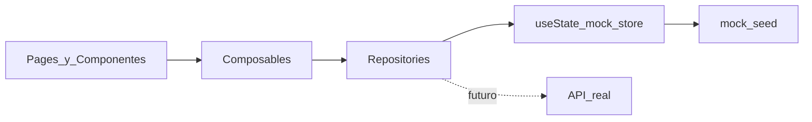

# WayAcademyValidator — Plan del prototipo visual

## Contexto

El directorio del proyecto está vacío. Se construirá **desde cero**, sin reutilizar el proyecto Moodle anterior. Esta etapa entrega solo un **prototipo visual navegable** con datos mock; Neon, Drizzle, Auth real, Papa Parse y Netlify quedan fuera del alcance de implementación.

El nombre del producto es **WayAcademyValidator** de forma uniforme (UI, README, brand, documentación). No usar abreviaciones del tipo “WayAcademy” como nombre del producto.

## Decisiones de arquitectura

| Decisión | Elección |
|----------|----------|
| Bootstrap | `nuxi init` con Nuxt 4 + TypeScript |
| UI | `@nuxt/ui` (Tailwind 4 incluido vía Nuxt UI) |
| Datos | Repositorios mock en `app/repositories/` + composables en `app/composables/` |
| Auth admin | Cookie/session simulada en cliente (`useAdminSession`); credenciales demo fijas |
| Estado global mock | **`useState()` de Nuxt** como store mock compartido; **no se instalará Pinia** |
| Routing | File-based routes de Nuxt (`app/pages/`) |
| Layouts | `default` (público), `admin` (panel), `auth` (login) |
| Snapshot de certificado | Inmutable tras importación; la UI nunca lee un “participante actual” mutable |
| Fechas | Separar `issuedAt`, `importedAt` y `verifiedAt` (ver sección de fechas) |
| Diferencias en importación | Nunca actualizan el snapshot publicado automáticamente; siempre generan auditoría |
| Máscara de cédula | Utilidad `maskDocument()` compartida (p. ej. `********90`) |
| Normalización | `normalizeCertificateCode()` y `normalizeDocument()` desde el prototipo |
| Credenciales demo | `admin` / `demo1234` documentadas en UI del login y en README |

**Principio de desacoplamiento:** las páginas y componentes **nunca** importan `mock/*.ts` directamente. Solo consumen composables (`useCertificates`, `useCourses`, …) que delegan en repositorios. Los repositorios leen y mutan el **store mock** inicializado desde seeds. Más adelante los repositorios se sustituyen por llamadas a API sin reescribir las páginas.



### Store mock con `useState()`

- Un composable central (p. ej. `useMockStore`) expone el estado compartido vía `useState('way-academy-validator-store', () => seed())`.
- Contiene colecciones mutables: `courses`, `certificates`, `imports`, `auditConflicts`, y metadatos de dashboard derivados o cacheados.
- Operaciones simuladas —crear curso, publicar, despublicar, confirmar importación, aceptar/rechazar conflictos— **persisten durante la navegación** entre páginas (misma sesión SPA).
- Los seeds en `app/mock/` solo se usan para **inicializar** el store (desde el composable/repositorio), nunca desde páginas o componentes de UI.
- **No se instalará Pinia.** Nuxt no tiene “Pinia implícita”; el mecanismo oficial de estado compartido en este prototipo es `useState()`.

## Dependencias mínimas (prototipo)

Al inicializar el proyecto:

- `nuxt` (v4)
- `vue` / `vue-router` (vía Nuxt)
- `typescript`
- `@nuxt/ui`
- `@nuxt/fonts` (si Nuxt UI lo recomienda) o fuentes vía Nuxt UI

**No instalar todavía:** Pinia, `drizzle-orm`, drivers Neon, `nuxt-auth-utils`, `bcryptjs`, `papaparse`, Zod (preferir tipos TS puros en esta etapa).

Documentar en README el stack definitivo previsto para fases posteriores.

## Estructura de carpetas prevista

```
way-academy-validator/
├── README.md
├── nuxt.config.ts
├── package.json
├── app/
│   ├── app.vue
│   ├── assets/css/main.css          # tokens / overrides sobrios
│   ├── layouts/
│   │   ├── default.vue              # público (validación)
│   │   ├── admin.vue                # sidebar + topbar admin
│   │   └── auth.vue                 # login centrado
│   ├── pages/
│   │   ├── index.vue                # consulta pública (código + cédula)
│   │   ├── certificados/
│   │   │   └── [code].vue           # detalle público
│   │   └── admin/
│   │       ├── login.vue
│   │       ├── index.vue            # dashboard
│   │       ├── cursos/
│   │       │   ├── index.vue
│   │       │   ├── nuevo.vue
│   │       │   └── [id].vue         # detalle/editar + listado certificados
│   │       ├── importaciones/
│   │       │   ├── index.vue        # historial
│   │       │   ├── nueva.vue        # wizard
│   │       │   └── [id].vue         # detalle importación
│   │       └── auditoria/
│   │           ├── index.vue
│   │           └── [id].vue         # detalle conflicto
│   ├── components/
│   │   ├── public/
│   │   │   ├── ValidateByCodeForm.vue
│   │   │   ├── SearchByDocumentForm.vue
│   │   │   ├── CertificateValidCard.vue
│   │   │   ├── CertificateNotFound.vue
│   │   │   ├── CertificateListItem.vue
│   │   │   └── CertificateDetailView.vue
│   │   ├── admin/
│   │   │   ├── AdminSidebar.vue
│   │   │   ├── StatCard.vue
│   │   │   ├── RecentImportsTable.vue
│   │   │   ├── ConflictsPreview.vue
│   │   │   ├── CourseForm.vue
│   │   │   ├── CourseStatusBadge.vue
│   │   │   ├── ImportWizard.vue
│   │   │   ├── ImportPreviewTable.vue
│   │   │   ├── ImportSummary.vue
│   │   │   ├── ImportHistoryTable.vue
│   │   │   ├── AuditConflictCard.vue
│   │   │   └── AuditDiffPanel.vue
│   │   └── shared/
│   │       ├── AppBrand.vue
│   │       ├── MaskedDocument.vue
│   │       ├── EmptyState.vue
│   │       ├── LoadingBlock.vue
│   │       ├── PageHeader.vue
│   │       └── StatusBadge.vue
│   ├── composables/
│   │   ├── useMockStore.ts          # useState() store compartido
│   │   ├── useAdminSession.ts
│   │   ├── useCertificates.ts
│   │   ├── useCourses.ts
│   │   ├── useImports.ts
│   │   └── useAudit.ts
│   ├── repositories/
│   │   ├── certificates.repository.ts
│   │   ├── courses.repository.ts
│   │   ├── imports.repository.ts
│   │   ├── audit.repository.ts
│   │   └── admin-auth.repository.ts
│   ├── mock/
│   │   ├── seed.ts                  # o seeds por dominio (solo para init del store)
│   │   ├── certificates.ts
│   │   ├── courses.ts
│   │   ├── imports.ts
│   │   ├── audit-conflicts.ts
│   │   └── dashboard.ts
│   ├── types/
│   │   ├── certificate.ts
│   │   ├── course.ts
│   │   ├── import.ts
│   │   ├── audit.ts
│   │   └── admin.ts
│   ├── utils/
│   │   ├── mask-document.ts
│   │   ├── normalize-certificate-code.ts
│   │   ├── normalize-document.ts
│   │   ├── format-date.ts
│   │   └── delay.ts                 # simular latencia
│   └── middleware/
│       └── admin-auth.ts            # protege /admin/* excepto login
├── public/
│   └── favicon.ico
└── docs/
    └── SECURITY-FUTURE.md           # CAPTCHA, rate limit, cifrado, fail-closed
```

## Fechas: `issuedAt`, `importedAt`, `verifiedAt`

Sustituir por completo el campo ambiguo `validatedAtBySystem`.

| Campo | Significado | Persistencia |
|-------|-------------|--------------|
| `issuedAt` | Fecha de expedición del certificado (`mdl_certificate_issues.timecreated`) | Parte del snapshot del certificado |
| `importedAt` | Fecha en que el certificado fue incorporado a WayAcademyValidator | Persistente en el certificado (fuera o junto al snapshot, pero no confundir con expedición) |
| `verifiedAt` | Fecha y hora de la **consulta pública actual** | **No** forma parte permanente del certificado; se calcula en el momento de la consulta/render |

En la UI pública:

- Resultado y detalle muestran `issuedAt` como “Fecha de expedición”.
- El detalle puede mostrar `importedAt` como “Registrado en WayAcademyValidator el …”.
- `verifiedAt` se muestra como “Consultado el …” (timestamp generado al validar/abrir el detalle en esa sesión de consulta).

## Tipos TypeScript clave

**`Certificate` (snapshot-first):**

```ts
interface Certificate {
  id: string
  certificateCode: string          // valor tal como se almacena (tras trim)
  certificateCodeNormalized: string // para búsqueda (trim; conserva mayúsculas/minúsculas)
  snapshot: {
    participantName: string
    documentNumber: string         // valor original importado
    documentNumberNormalized: string
    courseName: string
    issuedAt: string               // ISO desde timecreated
    moodle: {
      certificateIssueId: number
      certificateId: number
      courseId: number
      userId: number
    }
  }
  courseLocalId: string
  importedAt: string               // incorporación a WayAcademyValidator
  publicVisible: boolean           // derivado del estado del curso
  // verifiedAt NO vive aquí
}
```

**`Course`:** `moodleCourseId`, `name`, `isPublished` (default `false`), `certificatesCount`, `lastImportAt`.

**`ImportBatch` (trazabilidad ampliada):**

- `id` (ID de importación)
- `originalFileName`
- `fileHash` (hash simulado del archivo)
- `courseLocalId` / referencia al curso
- `importedBy` (administrador que realizó la importación)
- `importedAt`
- Contadores: total, nuevos, sin cambios, actualizables, conflictos, errores
- Estado: `completed` | `completed_with_conflicts` | `failed`

**`ImportPreviewRow` (trazabilidad ampliada):**

- `importId` (cuando ya existe el batch; en preview puede ser provisional)
- `rowNumber` (número de fila del CSV)
- `originalFileName`
- `fileHash`
- Código, participante, cédula enmascarada
- Estado: `new` | `unchanged` | `updatable` | `critical_conflict` | `error`
- Motivo / detalle
- Para filas con diferencias: snapshot almacenado, datos entrantes, `changedFields[]`

**`AuditConflict` (trazabilidad ampliada):**

- `id`
- `certificateCode`
- `courseLocalId` / nombre de curso
- `importId`
- `originalFileName`
- `fileHash`
- `csvRowNumber`
- `importedBy`
- `detectedAt`
- `storedSnapshot` (snapshot publicado actual)
- `incomingData` (datos recibidos; incluir valores originales y normalizados donde aplique)
- `changedFields: string[]` (lista exacta de campos modificados)
- `riskLevel`: `critical` | `high` | `medium`
- `status`: **`pending` | `accepted` | `rejected`** (sin estado `reviewed` paralelo)
- `reviewedAt`
- `reviewedBy`
- `observation`

Campos de identidad críticos (visualmente marcados, `riskLevel: critical`): nombre del participante, cédula, `userId` Moodle, curso asociado, mismo código con otro `certificate_issue_id`, mismo `certificate_issue_id` con otro código.

### Regla de no actualización automática del snapshot

Cualquier diferencia detectada sobre un certificado existente —incluida la clasificación `updatable`— debe:

1. Crear un registro de auditoría (`AuditConflict`).
2. Conservar intacto el snapshot publicado.
3. Esperar una decisión administrativa (`accepted` / `rejected`).
4. Aplicar el cambio al snapshot **solo** tras aceptación explícita en una **fase futura** (en el prototipo, “aceptar” puede marcar el conflicto como `accepted` y mostrar mensaje de que la aplicación del cambio queda para la fase real; **no mutar el snapshot publicado** en el prototipo).

Banner del wizard: “Ninguna diferencia actualiza automáticamente el certificado publicado. Toda discrepancia genera auditoría y requiere decisión administrativa.”

## Normalización (desde el prototipo)

Utilidades previstas:

- `normalizeCertificateCode(value)`: aplicar `trim`; **conservar** mayúsculas y minúsculas.
- `normalizeDocument(value)`: quitar espacios, puntos y guiones; convertir letras a mayúsculas; **no** eliminar caracteres alfabéticos.

Reglas de uso:

- Búsqueda y comparación usan valores normalizados.
- Auditoría y snapshots conservan los **valores originales** recibidos/importados.
- Enmascarado visual (`maskDocument`) opera sobre el valor a mostrar (típicamente el original o el normalizado de forma consistente en UI).

## Rutas y layouts

| Ruta | Layout | Acceso |
|------|--------|--------|
| `/` | `default` | Público |
| `/certificados/[code]` | `default` | Público |
| `/admin/login` | `auth` | Público |
| `/admin` | `admin` | Sesión demo |
| `/admin/cursos` | `admin` | Sesión demo |
| `/admin/cursos/nuevo` | `admin` | Sesión demo |
| `/admin/cursos/[id]` | `admin` | Sesión demo |
| `/admin/importaciones` | `admin` | Sesión demo |
| `/admin/importaciones/nueva` | `admin` | Sesión demo |
| `/admin/importaciones/[id]` | `admin` | Sesión demo |
| `/admin/auditoria` | `admin` | Sesión demo |
| `/admin/auditoria/[id]` | `admin` | Sesión demo |

Middleware `admin-auth`: si no hay sesión demo y la ruta empieza por `/admin` (excepto `/admin/login`), redirigir a login.

## Flujos de UI por módulo

### 1. Consulta pública (`/`)

Dos paneles/tabs claramente diferenciados (no un solo formulario ambiguo):

**Validar por código**

- Input + botón “Validar certificado”
- Validación básica: requerido, longitud mínima; búsqueda con `normalizeCertificateCode`
- `delay(600–900ms)` → loading
- Mock: códigos conocidos → `CertificateValidCard`; desconocidos → `CertificateNotFound`
- Card válida: badge “Certificado válido”, código, nombre, documento enmascarado, curso, **fecha de expedición (`issuedAt`)**, CTA “Ver detalle”
- En el resultado de esa consulta se calcula y muestra `verifiedAt` (consulta actual), sin persistirlo en el certificado

**Consultar por cédula**

- Input + “Consultar certificados”
- Normalización con `normalizeDocument` para la búsqueda
- Loading simulado
- Sin resultados → empty state genérico (mensaje no enumerativo)
- Con resultados → lista de `CertificateListItem` (curso, `issuedAt`, código, “Ver certificado”)

### 2. Detalle (`/certificados/[code]`)

- Brand `AppBrand` (texto **WayAcademyValidator**)
- Badge válido (o 404 visual si código inexistente / curso no publicado)
- Snapshot: código, participante, documento enmascarado, curso, **`issuedAt`**
- **`importedAt`**: “Registrado en WayAcademyValidator el …”
- **`verifiedAt`**: calculado al abrir/consultar el detalle (“Consultado el …”)
- Texto legal/informativo: datos del registro importado desde la plataforma académica
- CTA “Realizar otra consulta” → `/`
- Sin PDF / descarga

### 3. Login (`/admin/login`)

- Usuario + contraseña + toggle mostrar/ocultar
- Loading; error si no coinciden `admin` / `demo1234`
- Éxito → set session → `/admin`
- Nota visible: “Acceso de demostración — autenticación real en fase posterior”
- Sin registro público

### 4. Dashboard (`/admin`)

Stat cards derivados del store mock: cursos habilitados, certificados importados, participantes, última importación, conflictos pendientes.

Secciones: importaciones recientes, conflictos pendientes (preview), accesos rápidos (crear curso, importar).

### 5. Cursos (`/admin/cursos` + nuevo + detalle)

Tabla: Moodle ID, nombre, # certificados, publicado/no, última importación, acciones.

- Crear: solo config local; **`isPublished = false`** al crear; mutación en store `useState`
- Editar: nombre local / notas de config (no “sync Moodle”)
- Publicar / despublicar con confirmación (persiste en store)
- Detalle: metadatos + tabla de certificados del curso (desde snapshot)

### 6. Wizard importación (`/admin/importaciones/nueva`)

Steps: Curso → CSV (UI de dropzone, sin parse real) → Validar estructura (resultado mock OK/KO) → Preview (tabla clasificada) → Confirmar → Resumen.

Datos de preview y resumen desde `imports.repository.simulatePreview(courseId)` operando contra el store.

**Validación de curso por fila:** cada fila mock debe comparar `course_id` del CSV con el `moodleCourseId` del curso seleccionado. Si no coincide:

- Clasificar como `error`
- Motivo explícito (p. ej. “La fila pertenece a otro curso”)
- **Excluir** de la importación efectiva (no cuenta como nueva/actualizable)

Clasificación de filas: `new` | `unchanged` | `updatable` | `critical_conflict` | `error`.

Toda fila `updatable` o con conflicto genera auditoría y **no** modifica el snapshot.

Al confirmar: crear `ImportBatch` en el store (con `originalFileName`, `fileHash`, `importedBy`, etc.) y conflictos asociados; persistir contadores.

### 7. Historial (`/admin/importaciones` + `[id]`)

Tabla con métricas, archivo, hash (truncado), administrador, estado; detalle con desglose por fila y enlace a conflictos relacionados (archivo + número de fila).

### 8. Auditoría (`/admin/auditoria` + `[id]`)

Lista de conflictos; detalle con `AuditDiffPanel`:

- Snapshot almacenado vs datos entrantes
- Lista exacta de campos modificados
- Archivo original, hash, ID de importación, número de fila, administrador, `detectedAt`
- Riesgo, estado (`pending` | `accepted` | `rejected`)
- `reviewedAt`, `reviewedBy`, `observation`

Acciones UI simuladas: **aceptar** o **rechazar** (completan `reviewedAt` / `reviewedBy` / `observation`; mutan el store). No existe acción “marcar revisado” como estado intermedio. Aceptar **no** aplica el cambio al snapshot en este prototipo.

## Diseño visual

Dirección: sobria, confiable (inspiración Linear / Stripe / Attio).

- Tokens en CSS: fondo neutro frío, tipografía clara vía Nuxt UI, acento corporativo **azul petróleo / slate** (evitar púrpura genérico y “AI cream/serif”)
- Público: composición limpia, jerarquía fuerte en el resultado “válido” (confianza)
- Admin: densidad media, tablas legibles, sidebar fija en desktop, drawer en mobile
- Estados: loading skeletons/spinners, empty, error, success en todos los flujos clave
- Responsive: formularios apilados en mobile; tablas con scroll horizontal o cards apiladas en `<md`

## Datos de demostración (mínimo)

- 3–4 cursos (algunos publicados, uno no)
- 8–12 certificados con snapshots diversos (`issuedAt` ≠ `importedAt` en varios casos)
- 2–3 cédulas con múltiples certificados; 1 cédula sin resultados
- 2–3 códigos “válidos” documentados en README para demos
- 3–4 importaciones históricas con `originalFileName` + `fileHash` + `importedBy`
- 3–5 conflictos de auditoría (al menos 2 `critical`; todos con archivo, fila, snapshots y `changedFields`)
- En el wizard mock: al menos una fila de **otro** `course_id` clasificada como `error`

## Seguridad futura (solo documentación)

Archivo [`docs/SECURITY-FUTURE.md`](docs/SECURITY-FUTURE.md) con:

- Turnstile/CAPTCHA, rate limit por IP, log de consultas públicas
- Respuestas genéricas sin resultados
- Cifrado de cédula + hash normalizado para búsqueda
- Anti-enumeración, validación estricta CSV
- **Fail-closed en producción** si protecciones no están configuradas (sin flag que las apague accidentalmente)

En el prototipo: consultas mock **sin** CAPTCHA ni límites.

## Orden de implementación recomendado

1. Scaffold Nuxt 4 + Nuxt UI + tokens CSS + layouts + `AppBrand` (WayAcademyValidator)
2. Tipos + seeds + `useMockStore` (`useState`) + repositorios + composables + utilidades (`delay`, `maskDocument`, `normalizeCertificateCode`, `normalizeDocument`)
3. Páginas públicas: `/` + `/certificados/[code]` (fechas `issuedAt` / `importedAt` / `verifiedAt`)
4. Auth simulada + middleware + `/admin/login`
5. Layout admin + dashboard (lectura del store)
6. Cursos (listado, nuevo, detalle/editar/publicar) con mutaciones persistentes en store
7. Wizard de importación (validación de `course_id`, sin auto-update, generación de auditoría)
8. Historial de importaciones
9. Auditoría (`pending` / `accepted` / `rejected`)
10. README (credenciales demo, códigos/cédulas de prueba) + `SECURITY-FUTURE.md`
11. Pasada responsive + estados vacíos/error + criterios de aceptación

## Criterios de aceptación verificables

- [ ] App arranca con `npm run dev` y navega sin errores de consola críticos
- [ ] El nombre del producto mostrado es **WayAcademyValidator** de forma consistente
- [ ] `/` permite validar por código (válido, no encontrado, loading, validación de campo)
- [ ] `/` permite consultar por cédula (lista, vacío, loading)
- [ ] Documento siempre enmascarado en UI pública
- [ ] Se diferencian correctamente `issuedAt` (expedición), `importedAt` (incorporación) y `verifiedAt` (consulta actual, no persistente)
- [ ] `/certificados/[code]` muestra snapshot + `issuedAt` + `importedAt` + `verifiedAt` de la consulta + mensaje de origen importado
- [ ] Login demo funciona; credenciales incorrectas muestran error; no hay registro
- [ ] Rutas `/admin/*` (salvo login) redirigen sin sesión
- [ ] Dashboard muestra los 5 indicadores y accesos rápidos
- [ ] Cursos: crear queda **no publicado**; publicar/despublicar visible
- [ ] Wizard de 6 pasos con preview clasificado y resumen (todo mock)
- [ ] Filas cuyo `course_id` no coincide con el `moodleCourseId` del curso seleccionado se clasifican como `error` y se excluyen de la importación
- [ ] Ninguna diferencia (`updatable` o conflicto) modifica automáticamente el snapshot publicado; se crea auditoría y se espera decisión
- [ ] Historial y detalle de importación visibles (archivo, hash, administrador, métricas)
- [ ] Auditoría muestra archivo, fila de origen, snapshot vs entrantes, `changedFields`, riesgo; estados solo `pending` | `accepted` | `rejected` con `reviewedAt` / `reviewedBy` / `observation`
- [ ] Crear curso, publicar, despublicar, importar y decidir conflictos **persisten** al navegar entre páginas (store `useState`)
- [ ] Ningún componente de página importa `mock/` directamente; repositorios operan contra el store
- [ ] Sin Pinia, Neon, Drizzle, CSV real, Moodle API, CAPTCHA ni auth real
- [ ] README documenta demo + stack futuro; `SECURITY-FUTURE.md` presente

## Fuera de alcance (explícito)

Implementación real de DB, migraciones, Auth Utils, bcrypt, Papa Parse, Zod de dominio, CAPTCHA, rate limits, PDF, API Moodle, Pinia, commits, aplicación automática de cambios aceptados al snapshot (fase futura), y cualquier feature no listada arriba.

## Entregable de esta fase de planificación

Este plan actualizado. **No se implementa nada hasta tu aprobación explícita.**
